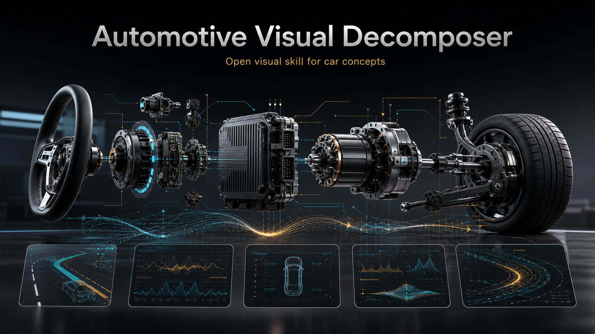
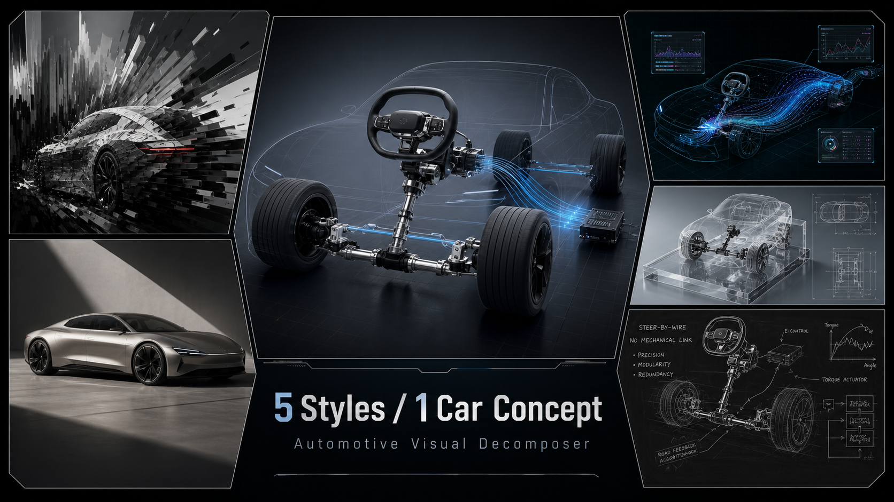

# Automotive Visual Decomposer



Turn one automotive concept into a visual decomposition path: choose a style, choose a canvas, reason through the engineering structure, then output a production-ready image prompt.

This skill is built for automotive explainers, technical posters, WeChat-style long images, presentation visuals, and concept breakdowns. It defaults to prompt output, and recommends AI Studio / Nano Banana Pro 4K as the primary render route when image quality matters.

## What It Does

Input a concept such as `线控转向`, `800V 高压平台`, `域控制器`, `热泵空调`, or `CTC 电池底盘`.

The skill then asks for:

- Style: `dimension-breaker`, `titanium-editorial`, `holo-flux`, `crystal-slate`, or `blackboard-engineering`
- Aspect ratio: `3:4`, `16:9`, or a custom ratio
- Output mode: `prompt-only`, `prompt+image`, or `image-only`

It returns:

- Selection path
- Visual reasoning summary
- Full English rendering prompt with explicit Chinese visible labels and the public creator mark

## Style System

| Style | Best For | Visual Signature |
| --- | --- | --- |
| `dimension-breaker` | mechanical conflict, hidden risk, destructive metaphors | torn technical paper, heavy parts, dark carbon fiber, warning accents |
| `titanium-editorial` | premium explainers and magazine covers | off-white paper, Prussian Blue ink, silver component, Swiss grid |
| `holo-flux` | SDV, ADAS, cockpit UI, sensors, electrification | holographic foil, chrome parts, acid green UI, black data bars |
| `crystal-slate` | spatial UI, sensor fusion, high-end abstract systems | frosted glass slate, cyan HUD, transparent cards, calm precision |
| `blackboard-engineering` | teaching formulas and mechanism breakdowns | matte blackboard, chalk schematics, steel component, red chalk accents |



## Demo Concept: 线控转向

The example prompts in `examples/prompts/` use the same concept, `线控转向 / Steer-by-Wire`, across all five styles. The output images below were rendered with AI Studio using Nano Banana Pro + 4K.

| Dimension Breaker | Titanium Editorial |
| --- | --- |
|  |  |

| Holo Flux | Crystal Slate |
| --- | --- |
|  |  |

| Blackboard Engineering |
| --- |
|  |

## Install

Copy this folder into your Codex skills directory:

```bash
mkdir -p "$HOME/.codex/skills"
cp -R automotive-visual-decomposer "$HOME/.codex/skills/"
```

Then ask Codex:

```text
Use automotive-visual-decomposer. Visualize 线控转向.
```

## Recommended Render Flow

1. Use the skill to produce the final prompt.
2. Render with AI Studio / Nano Banana Pro 4K for production output.
3. In Codex or Antigravity, use the internal image engine only when the environment has an available image renderer and you want direct drawing inside the agent.

The prompts keep the public personal-IP mark `雪沐江南 · VISUAL ARCHITECT` / `Xuemu_Lab`, while avoiding emails, account details, local paths, cookies, API keys, fake logos, QR codes, fake standard numbers, and unreadable microtext. For current model specs, prices, regulations, or launch claims, verify facts before rendering.

## Repository Hygiene

This open-source package contains reusable skill instructions, full sanitized style protocols, example prompts, generated demo assets, and the public creator signature. It does not include emails, account details, cookies, API keys, local machine paths, or private publishing workflow data.

## License

MIT License. See `LICENSE`.
